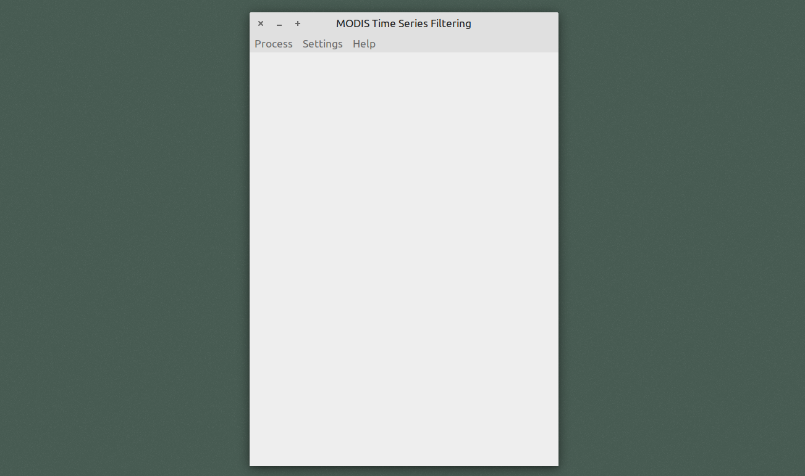

# MODIS Time Series Filtering

SER-347 Introdução à Programação para Sensoriamento Remoto

Autores:
+ Bruno Menini Matosak
+ Marcos Antônio de Almeida Rodrigues
+ Tatiana Dias Tardelli Uehara

## Objetivo

O presente trabalho teve como objetivo a criação de uma ferramenta em Python com interface gráfica, para a obtenção e processamento de dados de séries temporais MODIS (MOD13Q1).

## Pré-Requisitos

O _script_ necessita dos seguintes pacotes para Python 3.

+ gi (Gtk e GObject, versão 3.0)
+ sys
+ matplotlib
+ wtss*
+ numpy
+ datetime
+ csv
+ scipy
+ math

\* Informações sobre a biblioteca _wtss_ podem ser encontradas neste [link](https://github.com/e-sensing/wtss.py).

Além das bibliotecas supracitadas, ressalta-se que uma conexão com a internet é imprescindível para o correto funcionamento do _script_.

## Uso do _Script_

### Processando Dados

A ferramenta desenvolvida trata-se de um _script_ executável em Python 3. Ao executar o arquivo "./trabalho_final-Bruno_Marcos_Tatiana.py", o usuário depara-se com uma janela inicial, onde ações podem ser tomadas a partir da barra de menu superior, como ilustra a figura a seguir.

No item "_Process_" do menu, o usuário pode escolher entre "MOD13Q1" (dados dos produtos MODIS), "MOD13Q1_M" (dados de qualidade dos dados MODIS), e "Exit" (encerra o _script_).

Ao selecionar a opção "MOD13Q1" ou "MOD13Q1_M", abre-se a seguinte janela de seleção de dados para o processamento.

O usuário deve entrar então com dados de Latitude e Longitude (graus decimais), a série a ser acessada, as datas de início (YYYY-MM-DD), os filtros que deseja aplicar à série temporal, se deseja remover _outliers_ antes do processamento e o tipo de gráfico a ser montado.

As seguintes séries estão disponíveis até o momento:

+ MOD13Q1
  + mir
  + blue
  + nir
  + red
  + evi
  + ndvi

+ MOD13Q1_M
  + quality
  + reliability

Disponibiliza-se dois tipos de gráficos a serem plotados:
+ Linha
+ Polar

Caso o usuário opte apenas pela visualização do tipo de gráfico selecionado, ele deve clicar em **Process**, caso deseje salvar os dados em um arquivo do formato "_.csv_", ele deve clicar na opção "_Process + Save to CSV_".

Um exemplo de gráfico do tipo Linha pode ser visto na figura a seguir.

Ao optar por salvar os dados em uma tabela do tipo "_.csv_", o usuário pode armazenar todos os dados brutos e trabalhados de acordo com as opções selecionadas. No cabeçalho da tabela encontram-se todas as informações necessárias dos processamentos realizados sobre os dados.

### Filtros

O _script_ oferece 5 opções de aplições de filtros, sendo elas:

+ Filtro de pirâmide
+ Filtro de média
+ Filtro de Gauss
+ Filtro de Savitzky-Golay
+ Filtro de Whittaker-Eilers

Para a alteração dos parâmetros de configuração de cada filtro, o usuário deve clicar na opção "_Settings_" da barra de menu, e em seguida clicar em "_Filters_". Uma janela é então apresentada, como mostrado na figura a seguir.

No filtro de pirâmide é feita uma média ponderada dos termos. O único parâmetro de entrada é o tamanho da janela de pesos da filtragem, a qual é definida seguindo um modelo de pirâmide. O primeiro termo tem peso igual a 1, o seguinte termo tem seu peso acrescido de 1 em relação ao anterior, e assim por diante até o termo do centro da janela, a partir do qual começa-se a subtrair 1 do peso anterior para a definição do peso subsequente. O termo central (de maior peso) é usado para o termo a ser filtrado e os termos adjacentes da janela são usados como pesos para os termos adjacentes ao valor filtrado.

No filtro de média, o parâmetro de entrada também é apenas o tamanho da janela de filtragem. Dentro da janela, o centro é estabelecido no valor a ser filtrado e, então, feita a média para os valores adjacentes.

O filtro de Gauss funciona de forma muito semelhante ao filtro de pirâmide, porém, a definição dos pesos da janela de filtragem é feita através de uma função do tipo Gaussiana. Os parâmetros de entrada são o tamanho da janela de filtragem e o desvio padrão para a função gaussiana.

O filtro de Savitzky-Golay é descrito neste [artigo](https://pubs.acs.org/doi/pdf/10.1021/ac60214a047). Os parâmetros de entrada são o tamanho da janela de filtragem, a ordem do polinômio de ajuste, a ordem da derivada e a taxa.

O filtro de Whittaker-Eilers é descrito de forma completa neste [artigo](https://pubs.acs.org/doi/abs/10.1021/ac034173t). Os parâmetros de entrada são o tamanho da janela de filtragem e a agressividade da filtragem.

### Remoção de _Outliers_

É oferecida uma opção para a retirada de _outliers_ da série antes da filtragem. O processo é simples, implementado de acordo com este [artigo](https://www.mdpi.com/2072-4292/5/12/6159). Caso detectada a ocorrência de um _outlier_ na série, este é substituído pela interpolação simples de seus vizinhos imediatos à esquerda e direita.

O processo necessita apenas de um parâmetro de entrada: a porcentagem limiar da diferença para com seus vizinhos. O valor padrão é 1%, e para alterá-lo basta que o usuário acesse o item "_Settings_" da barra de menu, e em seguida o item "_Outliers Removal_". A figura a seguir demosntra a janela de alteração dos parâmtros de remoção de _outliers_.

## Agradecimentos

Os autores gostariam de agradecer ao Prof. Gilberto Ribeiro de Queiroz, pelo auxílio quanto ao uso da biblioteca _wtss_.

Os autores agradecem também ao usuário do GitHub mhvwerts, pela ajuda na implementação do código da filtragem de Savitzky-Golay.
